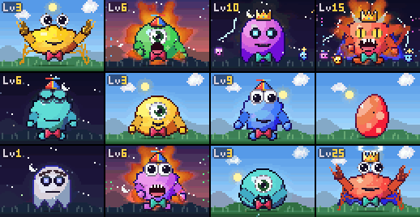

# Claude Token Monster

[](https://github.com/ugglr/dad)

A pixel-art virtual pet that lives in a side pane of Claude Code and eats your tokens. One glance tells you how full your context is, how close you are to your limits, and what Claude is doing right now. **[See it live](https://ugglr.github.io/claude-token-monster/)** (the monsters on the site are real, type to feed them).

## Install

Inside Claude Code:

```
/plugin marketplace add ugglr/claude-token-monster
/plugin install token-monster@token-monster
```

Start a new session and the monster moves in. Needs Claude Code 2.1.287 or later; looks best in a terminal with 24-bit color.

Update: `claude plugin marketplace update token-monster`, then `claude plugin update token-monster@token-monster`. Remove: `claude plugin uninstall token-monster@token-monster`.



## Use

The pane opens by itself in a terminal 144 columns wide or more; at any width, run `/token-monster`. Focus it with `ctrl+x tab`, then:

`m` swap monster, `c` swap color, `p` pet, `d` diet, `s` sound on or off, `ctrl+x x` close.

Or by name: `/token-monster slime green`, `/token-monster diet`, `/token-monster sound on`. Monsters: cookie, slime, ghost, gremlin, crab.

## Read the monster

- **Size:** how full the context is. The bar below splits it by category, as `/context` does.
- **Face:** its mood. Stuffed past 75%, dizzy past 90% of the point where Claude Code auto-compacts (time to `/compact`). Sad and then grey if nothing feeds it.
- **Glow:** your session and weekly limits, green to amber to pulsing red.
- **Chewing:** how fast tokens stream right now, colored by tool.
- **On fire:** tool calls landing back to back. Three or more end the turn in a K.O.
- **Gagging:** one tool result over 20k tokens. It turns green, clutches its throat and coughs, and the readout names the call and points you at the diet (`d`).
- **Fed up:** the same tool call (same tool, same file or command) failed twice in a row. It crosses its arms under a throbbing anger mark for a few seconds. It only shows; Claude is never told.
- **Super mode:** subagents running. Each one shows up as a little helper that feeds it. With the rate pegged too, it goes into a full frenzy.
- **Calling you:** Claude is waiting on you, at a permission dialog or a question. It waves both hands and hops, a ! blinks beside its head, and the readout names the call; with sound on, one soft chime. It stops when you answer.
- **Cold leftovers:** a frosted bowl with a snowflake beside it. The prompt cache has lapsed since Claude's last response (after 5 minutes, or an hour once it sees your session keeps it that long), so the readout estimates how many tokens your next prompt re-reads uncached.
- **Levels:** it grows with every token it eats, across sessions, and earns a bow tie, a propeller cap, a crown, a cape and a halo. Each session starts with an egg.

It also sleeps when nothing happens, waves when you come back, and does little antics while it waits.

## Put it on a diet

Today you can only `/clear` or `/compact` the whole conversation. Press `d` to list the biggest tool results in your context, pick some (or all of one kind, like every Read), and press `e`. Your next `/compact` replaces just those with a short note and leaves everything else as it was.

## What it sees

Mods are not sandboxed, so read the code before you install any mod. This one reads:

- the model's response stream (text, thinking, tool arguments, and the token and cache counts of each response), your prompts and each tool result, for the main conversation and subagents, measured for length and not kept
- each tool call's name and its file path, description, command, URL, search pattern or prompt, shown in the readout and the diet
- the status line's context, limit and cost figures, and the `/context` breakdown with the auto-compact point (a local estimate, no request)
- the running subagents, and the `COLORTERM` variable to pick colors
- when a permission dialog or a question opens for you, with the tool and its label
- the conversation's tool results when you open the diet, and the conversation on a diet `/compact`

It stores your monster and color, the tokens it has eaten, whether sound is on, and whether you've seen the sound tip. Sound is off by default: one soft chime when Claude starts waiting on you, played through `afplay` on macOS. No network calls.

## Notes

Token counts are estimates (about four characters a token); the context and limit figures are Claude Code's own. A diet meal rebuilds the messages that held eaten results from their text, and skips results that sit next to an image or document. Built with Claude Code and reviewed by [Dad](https://github.com/ugglr/dad). Develop with `claude plugin validate .` and `claude plugin test .`.

Cookie Monster is a trademark of Sesame Workshop, Tamagotchi of Bandai, Dragon Ball and Super Saiyan of their owners, Street Fighter of Capcom. Named only as inspiration; not affiliated.

MIT
