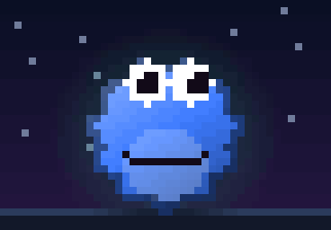
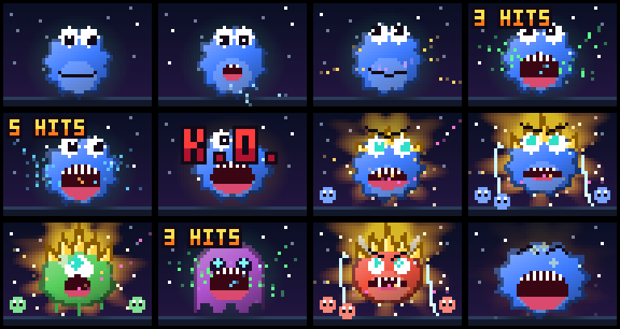
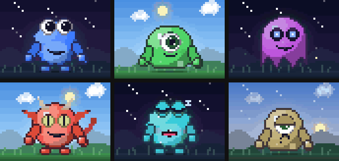
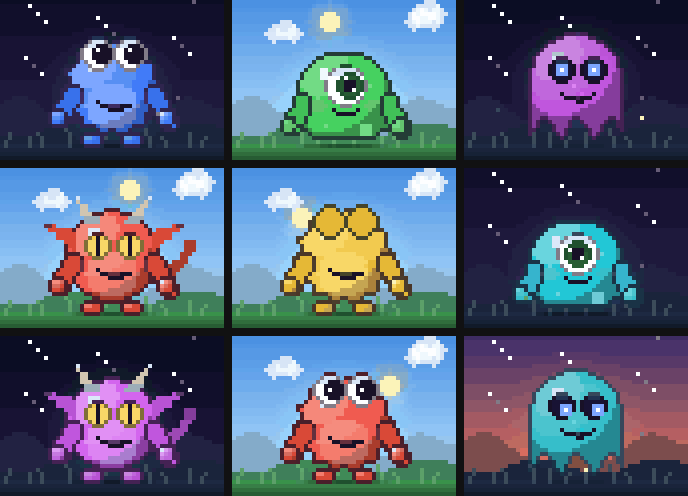
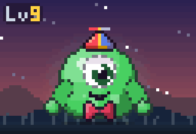
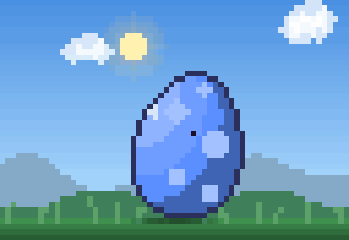

# Claude Token Monster

[](https://github.com/ugglr/dad)

A pixel-art Tamagotchi that lives in a side pane of Claude Code and eats your tokens. It is also a dashboard: one glance at the monster tells you how full your context is, how close you are to your limits, and what Claude is doing right now.



## Read the monster

| What you see | What it means |
| --- | --- |
| **Its size** | How full the context window is. The belly inflates as the context fills. |
| **Its face** | Its mood: hungry, happy, stuffed past 75%, dizzy eyes past 90% (time to `/compact`), a happy squint after a burp. These go by the point where Claude Code auto-compacts, which comes well before the window is full; the belly bar shows the full window. |
| **Tears, then a grey droop** | Tamagotchi hunger: sad after 15 minutes without tokens, starving and greying after an hour. A hungry monster does not doze off. Feed it to cheer it up. |
| **The glow around it** | Your session and weekly limits: green with room to spare, amber past 50%, pulsing red past 80%. It sweats when you get close. |
| **How hard it chews** | How fast tokens are flowing right now. It sits still when nothing streams, nibbles as Claude starts writing, and shovels food in with both hands, bouncing and shaking, as the rate climbs. Crumbs fly. |
| **Tokens flying into its mouth** | The actual stream, piece by piece: gold for text, lilac for thinking, then by tool: green Bash, blue reads and searches, orange edits, purple web, pink agents. A big tool result is a big meal. |
| **Rubbing its hands, drooling** | You are typing. It perks up when you send the prompt, which floats up into its mouth. |
| **Hand on its chin** | Claude is thinking, and nothing has streamed yet. |
| **On fire** | A combo: tool calls landing back to back. From the second, flames engulf it, climbing higher and hotter with every hit and throwing embers. A turn that landed three or more ends in a **K.O.** with confetti; a failed tool call makes it flinch, with a **COUNTER**. |
| **A happy hop** | A turn finished. Sparkles. |
| **Little antics** | Nothing is happening right now. Every 15 to 45 seconds it does something small: stretches, scratches its side, looks around and shrugs, waves at you, chases a butterfly by day or a firefly by night, juggles a token and eats it, hops, peeks at the readout, or tries to catch a falling star. It stops the moment anything happens. |
| **A wave hello** | You started typing after two quiet minutes. |
| **A yawn, then sleep** | Nothing has happened for three minutes and it is well fed. It wakes when you start typing. |
| **The sky** | Your local time: dawn, day with drifting clouds, dusk, and night with the moon, stars, the odd shooting star and fireflies. |
| **Super mode** | Subagents power it up: a golden flame aura, spiky gold hair and teal eyes. Each running subagent (or three tools at once) adds a level; level 2 crackles with lightning, level 3 is over 9000. Each subagent shows up as a little helper in its own color that dances beside it and runs over now and then to toss a token into its mouth. A belly about to burst or a limit past 80% still shows through. |

Under the sprite, a readout gives the exact numbers:

```
om nom nom nom
> Bash Run the tests  on fire x4
belly   ████████████░░░░░░░░  62% 124k/200k
session ███████░░░░░░░░░░░░░  35% 2h14m
weekly  ████░░░░░░░░░░░░░░░░  22% 4d3h
Lv 7    ━━━━━━━━━─────────── 912k to Lv 8
m: Monster  c: Color  d: Diet: free context  p: Pet
s: Sound: off
```



## Pet it

Press `p` in the pane to pet the monster. Hearts float up, it blushes, squeezes its eyes shut and wiggles, and says something back under the picture. Pet it a few times in a row and it gets fonder, up to a happy spin; the fondness fades over a few minutes. Pet it while it sleeps and it smiles without waking. Pet it while it is starving and it gives you a pleading look.





## It grows up with you

Every token it eats counts toward its level, across all your sessions: the stream, tool results and your prompts. The first levels come within the first hour of work, the later ones take days and then weeks. The readout shows the level and how far it is to the next, and a small badge sits in the corner of the sprite.

A level-up is a moment: a flash, a beam of light, a spinning jump, and LV UP rising behind it. On the way it earns things to wear, and keeps them, on every monster:

| Level | It gets |
| --- | --- |
| 3 | a bow tie |
| 6 | a propeller cap, which spins as it eats |
| 10 | a crown, in place of the cap |
| 15 | a cape that sways and billows |
| 25 | a glowing halo |



Each new session starts with an egg in the monster's color. It wobbles, cracks, glows through the cracks and bursts, and the monster pops out cheering. Open the pane more than 20 seconds after the session starts and the egg is skipped; a hot reload never hatches it again.



## Put it on a diet

Today you can only `/clear` or `/compact` the whole conversation. The diet lets you pick what goes. Press `d` in the pane, or run `/token-monster diet` (or `eat`), to switch the pane to the diet and list the biggest tool results sitting in this conversation's context right now (file reads, command output, web pages), with the context fill and where it would land after eating. Press `1` to `9` to tick the ones you no longer need, then `e` to **Eat**, or `q` to go back to the monster.

Eat arms the diet, puts `/compact` in your prompt, and the monster tells you how many tokens it is about to eat from the context. Press Enter, and instead of summarizing the conversation, Token Monster replaces each picked result with a short note, so the model knows something was there and can run the tool again if it needs it. **Cancel** in the pane disarms it, and an automatic compaction is never touched. If the picked results are already gone (an earlier compaction or `/clear` took them), the diet disarms and your `/compact` summarizes as usual.

What changes, exactly: each message holding an eaten result is rebuilt from its text. The diet only offers results whose message holds no image or document, so nothing else in it is lost; several text blocks in such a message are joined into one. Every other message stays exactly as it was. The next turn reads the context uncached once.

## Sound

Token Monster can make chiptune noises: a chomp as it eats, a gulp for a big tool result, a burp after `/compact`, hits that climb in pitch through a combo, a K.O. jingle, a power-up and a power-down for super mode, a little cheer when a turn finishes, a buzz for a failed tool call, a whimper when it gets hungry, a soft snore now and then while it sleeps, and a chirp to say hello.

Sound is off by default. Press `s` in the pane, or run `/token-monster sound on` (or `off`), to turn it on. Your choice is remembered across sessions. It plays quietly and keeps out of the way: chomps at most three a second and only while the pane shows, one clip of a kind at a time, and nothing while you type.

It plays on macOS only, through `afplay`. A Linux or Windows terminal has no player, so it stays silent there.

The sounds are original, made for this mod by [`scripts/make-sounds.py`](scripts/make-sounds.py) from square, triangle and noise waves, with the Python standard library only. Run `python3 scripts/make-sounds.py` to make them again, or add `--check` to print each one's length and peak level.

## Requirements

- Claude Code 2.1.287 or later, where mods load by default. Built and tested on 2.1.288.
- For the pixel art, a terminal. It looks best with 24-bit color (iTerm2, Ghostty, WezTerm, Kitty); a terminal that rounds to 256 colors, such as Apple Terminal on older macOS, shows it flatter.
- No environment variables, packages or configuration.

## Install

Inside Claude Code:

```
/plugin marketplace add ugglr/claude-token-monster
/plugin install token-monster@token-monster
```

Or from your terminal:

```bash
claude plugin marketplace add ugglr/claude-token-monster
claude plugin install token-monster@token-monster
```

Start a new Claude Code session and the monster moves in. Or try it for one session without installing:

```bash
git clone https://github.com/ugglr/claude-token-monster
claude --plugin-dir ./claude-token-monster
```

To update to the latest version:

```bash
claude plugin marketplace update token-monster
claude plugin update token-monster@token-monster
```

To remove it:

```bash
claude plugin uninstall token-monster@token-monster
```

## Use

The pane opens by itself when the terminal is at least 144 columns wide. At any width, run `/token-monster`. In fullscreen it docks beside the transcript; otherwise it sits above the prompt.

Focus the pane with `ctrl+x tab`, then press `m` to swap the monster, `c` to swap the color, `d` for the diet, `p` to pet it, and `s` to turn sound on or off. `ctrl+x x` closes the pane. Or name them:

```
/token-monster slime green
/token-monster gremlin
/token-monster diet
/token-monster sound on
```

Monsters: `cookie`, `slime`, `ghost`, `gremlin`. Colors: `blue`, `cyan`, `green`, `yellow`, `magenta`, `red`, `white`. Your pick is remembered across sessions.

The pixel art draws in the terminal. The desktop app and IDEs show an ASCII version of the monster with the same readout. When the pane cannot show, because the terminal is too narrow or you closed it, a one-line version sits above the prompt: face, mood, the belly gauge and your limits.

The limit bars show whatever limits Claude Code reports: the 5-hour session and weekly windows on a Claude subscription, or a gateway's spend limit.

## Develop

```
claude plugin validate .
claude plugin test .
```

Mods are not sandboxed, so read the code before you install any mod. Here is everything this one sees:

- **The model's response stream**, as it arrives, for the main conversation and every subagent: text, thinking, and the arguments of each tool call. It measures their length to animate the monster and keeps nothing.
- **The text of each prompt you send**, and **each tool result**, subagents' included, measured the same way.
- **The context, limit and cost figures** Claude Code already shows in its status line.
- **Each tool call's name and its file path, description, command, URL, search pattern or query, or prompt**, shown in the readout and kept in the diet's list for the session.
- **Your prompt while you type it**, only to notice that you are typing.
- **The conversation's tool results**, when you open the diet, to list them; and on a diet `/compact`, the conversation, to replace the results you picked.

It stores only your monster and color choice, whether sound is on, and the number of tokens it has eaten, and sends nothing anywhere: there is no network call in the code.

## How it was built

- **Model:** built with Claude Opus 5.5 in Claude Code, using the `plugin-authoring` skill and the mod API's TypeScript types. The mod itself never calls a model.
- **Prompts:** it started as one line: a monster, a play on a certain cookie-loving puppet, that eats tokens and shows how full the context is. Then, in turn: a side pane with an animated monster; swapping monsters and colors; Tamagotchi sadness when unfed; the session and weekly limits; deleting chosen things from the context, "because today we can only clear or compact"; nicer monsters to screencap; idle when nothing flows and more intense as tokens flow; subagents as a super-hero power-up; fighting game combos.
- **Review:** every change went through [Dad](https://github.com/ugglr/dad), an old-school code review agent, until it passed. Most of the iterations below were his finds.
- **Iterations:**
  - The first diet called `$.session.compact()` itself. A mod's own call skips that mod's hooks, so the diet could never answer it and Claude Code would have summarized everything while the toast said "Me ate". The diet now only arms itself and puts `/compact` in your prompt; your `/compact` is the one it answers.
  - A result sharing a message with an image or a PDF would have lost them, because a rebuilt message keeps only its text. Those results are never offered.
  - The diet was a second pane, and a mod cannot switch you back to another tab, so people got stuck in it. It is now a view inside the monster's pane.
  - The first animation looped on timers. It now follows the model's stream as it arrives: still when nothing flows, chomping harder as the rate climbs.
  - The burst warning first triggered at 90% of the window, which auto-compaction usually reaches first, so it never showed. It now goes by the auto-compact point, read from a local estimate that sends no request. Anthropic's [Token Weather](https://github.com/anthropics/claude-code-playground/tree/main/claude-code/mods/token-weather) mod notes the same gap.
  - The super mode aura was first painted over the night sky and came out muddy brown; it is now added as light.
  - A mod cannot pass `$` across an import, so the diet draws through its own hooks on the shared pane rather than being called.

## Notes / limitations

- Token counts from the stream, tool results and the diet are estimates, at about four characters a token. The context, limit and cost figures are Claude Code's own.
- A diet meal rebuilds each message that held an eaten result from its text, joining text blocks, and the next turn reads the context uncached once.
- The band above the prompt is shared: when another mod draws there, only one of them shows.
- Combos break after a 4 second pause. The sky goes by the clock of the machine Claude Code runs on. Super mode counts running subagents from the agent list, so it can take a moment to power down after a background agent finishes.
- The animation, combo and fondness state live in memory and start over when the mod reloads; your monster, color and level are kept. The antics and the hello only run while the pixel art is drawing. Eaten tokens are written to the store at most every 30 seconds, so a reload can lose up to that much.
- The level counts the same estimate the animation does, at about four characters a token, not your bill.
- Tested with 60 tests run by `claude plugin test`, and live in one long session, including a real diet meal. The animation is checked frame by frame from rendered stills and the demo above, not by tests.

## Dependencies

| Name | Version | License (SPDX) | Source |
| --- | --- | --- | --- |
| None | | | |

## Third-party notices

Cookie Monster is a trademark of Sesame Workshop. Dragon Ball and Super Saiyan are trademarks of their owners (Bird Studio, Shueisha, Toei Animation). Street Fighter is a trademark of Capcom. They are named only as inspiration; this project is not affiliated with or endorsed by any of them.

## License

MIT
